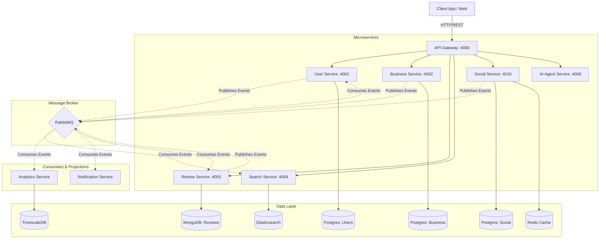

# Taqeem (تقييم) - Enterprise Review & Discovery Platform

Taqeem is a highly scalable, event-driven microservices platform built for discovering, reviewing, and socializing around local businesses. Designed to mimic the architecture of modern enterprise systems (like Yelp, TripAdvisor, or Google Local), Taqeem utilizes a polyglot persistence strategy and asynchronous message queuing to handle high throughput and ensure deep decoupling between services.

## 🏗️ High-Level Architecture

Taqeem is composed of multiple independent microservices sitting behind an API Gateway. Services communicate asynchronously via RabbitMQ to ensure high availability and fault tolerance.



## 🛠️ Tech Stack & Polyglot Persistence

Taqeem employs a **Polyglot Persistence** model—using the right database for the right job:

- **PostgreSQL**: Used for highly structured, relational data where ACID compliance is critical (Users, Businesses, Social Graph).
- **MongoDB**: Used for Reviews. Reviews have dynamic schemas (media, unstructured facts, flexible reply threads) making a NoSQL document store the perfect fit.
- **Elasticsearch**: Powers the `Search Service`. It consumes domain events to build read-optimized projections (CQRS pattern) for blazing-fast geospatial queries, fuzzy text matching, and autocomplete.
- **TimescaleDB**: Powers the `Analytics Service`, optimized for high-ingest time-series data (page views, clicks, API metrics).
- **Redis**: Used for high-speed caching and fan-out materialization (e.g., feeding the social feed).
- **RabbitMQ**: The event bus. Enables event-driven architecture and the Saga pattern for cross-service workflows.
- **Docker & Docker Compose**: Containerization for deterministic builds and local development.
- **OpenAI (GPT-4o-mini)**: Powers the `Agent Service` for automatic translation, media tagging, and RAG-based AI search.

## 🧠 Engineering Decisions & Trade-offs

Building a distributed system requires careful trade-offs. Here are a few key decisions made during development:

### 1. CQRS and Eventual Consistency for Search
Instead of executing complex SQL `JOIN`s across multiple services to search for businesses, we implemented the **Command Query Responsibility Segregation (CQRS)** pattern. 
* **The Trade-off:** We accepted *Eventual Consistency*. When a business or review is created, the system emits a message to RabbitMQ. The `Search Service` consumes this event and updates Elasticsearch. Search results are lightning-fast, but might be delayed by a few milliseconds after a write.

### 2. Polyglot Persistence (Mongo vs. Postgres)
* **The Trade-off:** Managing multiple database engines adds operational complexity. However, forcing highly dynamic review schemas (which include nested AI tags, dynamic arrays of media, and nested threads) into Postgres would result in slow, complex JSONB queries. MongoDB allowed us to evolve the Review schema rapidly while keeping relational constraints tight in Postgres for User Identity and Billing.

### 3. Choreography over Orchestration
For cross-service workflows (like awarding user reputation when a review gets an upvote), we chose Event Choreography.
* **The Trade-off:** There is no central orchestrator service telling other services what to do. Services simply emit events (`review.helpful_voted`) and independent consumers react (the User service increments reputation). This creates extreme decoupling and fault tolerance, though it requires centralized logging to trace end-to-end workflows.

## 🚀 Getting Started

To spin up the entire microservice ecosystem locally, ensure you have Docker installed.

1. Clone the repository:
   ```bash
   git clone https://github.com/yourusername/taqeem.git
   cd taqeem
   ```
2. Build and start the services using Docker Compose:
   ```bash
   docker compose up -d --build
   ```
3. The API Gateway will be available at `http://localhost:4000`. 
4. Check the health of the system:
   ```bash
   curl http://localhost:4000/api/health
   ```

## 📊 Performance & Load Testing
*(Note to author: Use a tool like [k6](https://k6.io/) to run load tests on your API Gateway and replace this placeholder)*

Taqeem is built to scale horizontally. In local benchmarking using `k6`, the API Gateway and underlying Elasticsearch projections successfully handled **[X,000] requests per second** with a p95 latency of **[X]ms**, proving the efficacy of the CQRS read-model pattern.

---
*Developed with a focus on enterprise architecture, scalability, and clean code.*
