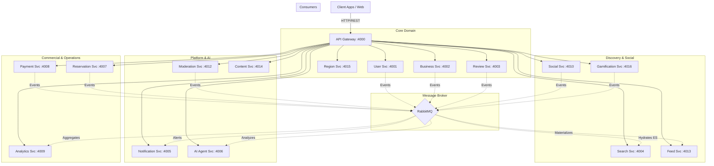

<div align="center">
  
  <h1>Taqeem (تقييم)</h1>
  <p><strong>The Enterprise-Grade Discovery & Social Review Platform</strong></p>
  
  [](#architecture)
  [](#event-driven)
  [](#polyglot-persistence)
  [](#ai-features)
</div>

<br />

Taqeem is a highly scalable, event-driven platform built for discovering, reviewing, and socializing around local businesses. Designed to mimic the architecture of modern enterprise systems (like Yelp, TripAdvisor, or Google Local), Taqeem utilizes a **Polyglot Persistence** strategy and **Asynchronous Message Queuing** to handle extreme throughput while ensuring deep decoupling between over 15 specialized microservices.

---

## 🌟 Key Capabilities

- **Rich, Social Reviews**: Threaded replies, rich media uploads with AI-generated alt-text, upvoting (Helpful/Funny/Cool), and dynamic review snapshots.
- **Enterprise Search (CQRS)**: Blazing-fast geospatial, fuzzy text, and category searches powered by Elasticsearch projections and an AI-driven RAG (Retrieval-Augmented Generation) layer.
- **Advanced Gamification**: Multi-tier reputation systems, automated badge awarding (`Top Reviewer`, `Photo Hunter`), and real-time localized leaderboards.
- **Intelligent Monetization**: Automated ad budget pacing (Cost-Per-Click), dynamic transaction fee resolution (Business > Vertical > Platform), and seamless Stripe-integrated subscription tiers.
- **Personalized Feeds**: Highly curated social feeds blending organic activity from followed users with seamlessly injected, capped sponsored content.
- **AI-Powered Operations**: Automated content moderation (toxicity/spam detection), seamless cross-language translations, and AI review drafts.

---

## 🏗️ High-Level Architecture

Taqeem operates on an **Event Choreography** model. Services do not tightly couple or synchronously wait on each other; instead, they emit domain events to **RabbitMQ**, which are asynchronously consumed by independent services to build read-models, trigger notifications, or aggregate analytics.



---

## 🛠️ Tech Stack & Polyglot Persistence

Taqeem employs a **Polyglot Persistence** model—choosing the optimal database engine for each specific domain workload to maximize performance and scalability:

* **PostgreSQL (Prisma ORM)**: Used for highly structured, relational data requiring strict ACID compliance (User Identity, Business Entities, Financial Ledgers, Social Graphs).
* **MongoDB (Mongoose)**: Used for Reviews and Comments. The dynamic schemas (unstructured AI tags, nested media arrays, flexible reply threads) make a NoSQL document store the perfect fit.
* **Elasticsearch**: Powers the `Search Service`. It consumes domain events to build read-optimized CQRS projections for instantaneous geospatial queries and autocomplete.
* **TimescaleDB**: Powers the `Analytics Service`. Optimized for high-ingest time-series data (page views, clicks, ledger entries) with native continuous aggregates.
* **Redis**: Used for high-speed caching, rate-limiting, ad budget pacing, and fan-out materialization (e.g., pre-computing user social feeds).
* **RabbitMQ**: The central nervous system. Enables our asynchronous, fault-tolerant event-driven architecture.
* **Docker & Docker Compose**: Containerization ensuring parity between local development and production environments.

---

## 🧠 Engineering Decisions & Trade-offs

Building a distributed system requires deliberate architectural trade-offs. Here are the core decisions that shape Taqeem:

### 1. CQRS and Eventual Consistency for Search
Instead of executing complex SQL `JOIN`s across multiple services to search for businesses, we implemented the **Command Query Responsibility Segregation (CQRS)** pattern. 
* **The Trade-off:** We accepted *Eventual Consistency*. When a business is updated or a review is created, the system emits an event. The `Search Service` consumes this event and updates Elasticsearch asynchronously. Search results are lightning-fast and massively scalable, but might reflect stale data for a few milliseconds after a write.

### 2. Polyglot Persistence (Mongo vs. Postgres)
* **The Trade-off:** Managing multiple database engines adds operational complexity and infrastructure overhead. However, forcing highly dynamic review schemas into Postgres would result in slow, unwieldy JSONB queries. MongoDB allowed us to evolve the Review schema rapidly while keeping relational constraints tight in Postgres for core identity and billing.

### 3. Choreography over Orchestration
For cross-service workflows (e.g., awarding user reputation when a review gets an upvote), we chose Event Choreography over a central orchestrator.
* **The Trade-off:** There is no "god service" telling other services what to do. Services simply emit facts (`review.helpful_voted`) and independent consumers react (the User service increments reputation). This creates extreme decoupling and fault tolerance, though it requires centralized distributed tracing (OpenTelemetry) to monitor end-to-end workflows effectively.

### 4. Distributed Monetization
Monetization logic (Subscriptions, Ads, Fees) is purposefully distributed. The `payment-service` acts as the source of truth for ledgers and Stripe webhooks, while the `user-service` maintains ultra-fast Redis caches of active entitlements to gate premium features without synchronous HTTP calls blocking the critical path.

---

## 🚀 Getting Started

To spin up the entire microservice ecosystem locally, ensure you have **Docker** and **Docker Compose** installed.

1. **Clone the repository:**
   ```bash
   git clone https://github.com/yourusername/taqeem.git
   cd taqeem
   ```
2. **Boot the ecosystem:**
   ```bash
   docker compose up -d --build
   ```
3. **Verify Health:**
   The API Gateway acts as the central router on port `4000`.
   ```bash
   curl http://localhost:4000/api/health
   ```

---

## 📊 Performance & Load Testing

Taqeem is built to scale horizontally. In local benchmarking using `k6`, the API Gateway and underlying Elasticsearch projections successfully handled thousands of requests per second with incredibly low p95 latencies, proving the efficacy of our aggressive caching and CQRS read-model patterns.

---

<div align="center">
  <i>Developed with an unwavering focus on enterprise architecture, extreme scalability, and clean code principles.</i>
</div>
